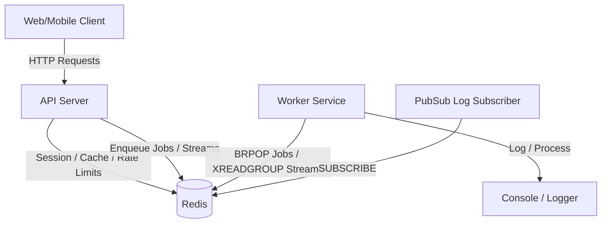

# PulseBoard: Real-Time Collaborative Operations Platform Backend with Redis

PulseBoard is a high-performance, real-time backend platform designed for remote engineering and operations teams to coordinate incidents, deployments, and other live operations events. 

To solve production scaling bottlenecks—such as API response lag, database overload, and real-time sync delays—PulseBoard uses **Redis** as a core component for real-time state, message broker services, caching, rate limiting, and analytics.

---

## 🏗️ Architecture Overview

The system consists of three distinct service layers that communicate asynchronously and statefully via Redis:

1. **API Server (FastAPI)**: Serves REST requests, performs authentication, handles input validation, increments rate limiters, queries analytics, and triggers real-time events.
2. **Background Worker (Python Asyncio)**: Processes long-running operations in the background. It implements:
   - A **Job Queue consumer** using Redis lists.
   - An **Event Stream processor** using consumer groups to guarantee at-least-once delivery.
   - A **Pub/Sub logger** to subscribe to live broadcast channels.
3. **Redis Data Store**: The multi-model in-memory engine storing active sessions, workspace members, activity logs, presence details, geospatial coordinates, and daily metrics.



---

## 🔑 Redis Key Naming Schema

We employ the industry-standard naming pattern `namespace:object_type:id:attribute`.

| Namespace / Key | Redis Data Structure | Description / Access Pattern |
| :--- | :--- | :--- |
| `session:{token}` | **String** | Authenticated session token mapping to `user_id`. Expired automatically (TTL: 3600s). |
| `rate_limit:{user_id}:{minute_timestamp}` | **String** | User-specific atomic counter mapping to a 1-minute window. Expired automatically (TTL: 60s). |
| `user:{user_id}` | **Hash** | Holds structured user profiles (`name`, `email`, `role`, `created_at`). |
| `online_users` | **Set** | Set of active online user IDs. Supports fast $O(1)$ presence membership lookups. |
| `workspace:{id}:members` | **Set** | User IDs belonging to a specific workspace. |
| `user:{id}:workspaces` | **Set** | Workspaces a specific user belongs to. Allows intersecting shared workspaces via `SINTER`. |
| `feed:{user_id}` | **List** | Personal operational activity feed. Append-only events capped at 100 items via `LTRIM`. |
| `channel:{id}:messages` | **Pub/Sub Channel** | Real-time chat messaging broadcast. |
| `channel:{id}:typing` | **Pub/Sub Channel** | Real-time typing indicators. |
| `stream:events` | **Stream** | Append-only event log for microservices coordination. Read by a consumer group. |
| `trending:channels` | **Sorted Set (ZSET)** | Channel activity rankings where score represents event volume. |
| `reputation:users` | **Sorted Set (ZSET)** | Gamified reputation score for active operations engineers. |
| `lock:{lock_name}` | **String** | Distributed mutual exclusion lock. Acquired via `SET NX EX` and released via atomic Lua. |
| `analytics:dau:{YYYY-MM-DD}` | **HyperLogLog (HLL)** | Cardinality estimation tracker for Daily Active Users (DAU) in $O(1)$ space. |
| `attendance:{user_id}:{YYYY-MM}` | **Bitmap** | Dense binary array tracking daily login attendance for the month (offsets 1-31). |
| `geo:active_users` | **Geo Set (GEO)** | Coordinates index of online users. Supports radius search. |
| `jobs:queue` | **List** | Job queue for asynchronous background tasks. Popped via blocking `BRPOP`. |

---

## 🚀 Setup & Run Instructions

### Prerequisites
- Docker & Docker Compose
- *Port note*: If port `6379` is already bound on your system (e.g. by another active database), the compose configuration is preset to map Redis to **`6389`** on the host. Host services remain unaffected, and containers communicate internally on container-to-container port `6379`.

### 1. Configure the Environment
Copy the example environment file:
```bash
cp .env.example .env
```

### 2. Boot Up the Containers
Run Docker Compose in detached mode:
```bash
docker compose up --build -d
```
This builds the Python images, spawns Redis, and spins up both services. **Seed data is automatically loaded** into Redis by the API server upon startup.

### 3. Verify Container Status
Check that all three containers are active:
```bash
docker ps
```
You should see:
- `pulseboard-redis` running on port `6389->6379`
- `pulseboard-api` running on port `8000->8000`
- `pulseboard-worker` running as a background service

### 4. Check Service Logs
To view the API server boots, automatic seeder runs, or the background workers processing queues:
```bash
docker logs -f pulseboard-api
docker logs -f pulseboard-worker
```

---

## 🧪 Integration Testing & Verification

We have included a comprehensive end-to-end integration test suite `verify_pulseboard.py` that validates all 12 core requirements programmatically.

To run the verification suite inside the running API container:
```bash
docker compose exec api python verify_pulseboard.py
```

### Expected Output
```text
==================================================
Starting PulseBoard Redis Backend Integration Tests
==================================================

Testing: 1. Sessions & Authentication
[✓] Login successful. User ID: usr_cd8aab92, Session Token: f1fe038f...

Testing: 2. User Profiles
[✓] User profiles created, updated, and retrieved successfully.

Testing: 3. Attendance Tracking & HLL Daily Active Users
[✓] Attendance tracked via Bitmaps and DAU counted via HLL. Active users today: 3

Testing: 4. Presence Tracking
[✓] Presence tracking (go online/offline, SMEMBERS, SISMEMBER) works.

Testing: 5. Workspaces & Membership Intersection
[✓] Workspace membership creation, retrieval, and SINTER intersection lookup works.

Testing: 6. Activity Feed
[✓] Activity feed retrieved (chronological, capped size LTRIM).

Testing: 7. Real-Time Messaging & Trending Channels
[✓] Messaging broadcast (Pub/Sub) and trending channels ranking (Sorted Sets) works.

Testing: 8. Event Streaming
[✓] Event streaming producer (XADD) works. Event ID: 1786600830450-0

Testing: 9. Distributed Locking
[✓] Distributed lock acquired, held safely, and released atomically using Lua.

Testing: 10. Geospatial Awareness
[✓] Geospatial awareness (GEOADD & GEOSEARCH radius check) works.

Testing: 11. Background Job Queue
[✓] Job enqueued onto List queue. Job ID: 45c15cde-26df-43ee-ad9d-9d35afd9370b

Testing: 12. API Rate Limiting
[✓] API Rate limiter correctly rejected spam requests with HTTP 429.

==================================================
ALL INTEGRATION TESTS PASSED SUCCESSFULLY! (12/12)
==================================================
```

---

## 🛠️ REST API Specification & Redis Usage Reference

### 1. Authentication & Sessions
- **POST `/auth/login`**: Accepts `{ "email": "...", "name": "...", "role": "..." }`. Generates user UUID and session token.
  - *Redis Command*: `HSET user:{user_id} ...` (Profile Hash setup)
  - *Redis Command*: `SETEX session:{session_token} 3600 {user_id}` (Session String with 1h TTL)
  - *Redis Command*: `SADD online_users {user_id}` (Presence Set append)
- **POST `/auth/logout`**: Closes the current session.
  - *Redis Command*: `DEL session:{session_token}`
  - *Redis Command*: `SREM online_users {user_id}`

### 2. User Profiles
- **GET `/users/{user_id}/profile`**: Retrieves entire profile hash.
  - *Redis Command*: `HGETALL user:{user_id}`
- **PUT `/users/{user_id}/profile`**: Updates specific profile keys.
  - *Redis Command*: `HSET user:{user_id} field value`
- **GET `/users/{user_id}/profile/fields`**: Retrieves a subset of fields.
  - *Redis Command*: `HMGET user:{user_id} field1 field2`

### 3. Workspaces & Membership (Transactions)
- **POST `/workspaces/{workspace_id}/members`**: Adds user to a workspace.
  - *Redis Pattern*: **MULTI / EXEC Transaction** guarantees atomic execution:
    ```python
    SADD workspace:{workspace_id}:members {user_id}
    SADD user:{user_id}:workspaces {workspace_id}
    LPUSH feed:{user_id} {workspace_joined_event}
    LTRIM feed:{user_id} 0 99
    ```
- **GET `/workspaces/common`**: Finds shared workspaces between user1 and user2.
  - *Redis Command*: `SINTER user:{user1}:workspaces user:{user2}:workspaces`

### 4. Real-Time Messaging & Trending Channels
- **POST `/channels/{channel_id}/messages`**: Broadcasts a message.
  - *Redis Command*: `PUBLISH channel:{channel_id}:messages {message_payload}`
  - *Redis Command*: `ZINCRBY trending:channels 1 {channel_id}` (Increments activity rank)
- **GET `/analytics/trending`**: Retrieves top $N$ active channels.
  - *Redis Command*: `ZREVRANGE trending:channels 0 N-1 WITHSCORES`

### 5. Distributed Locking
- **POST `/locks/trigger-daily-digest`**: Attempts to run a lock-protected background task.
  - *Redis Command (Acquire)*: `SET lock:daily_digest {owner_id} NX EX 10`
  - *Redis Command (Release)*: Executed via atomic **Lua Script**:
    ```lua
    if redis.call("get", KEYS[1]) == ARGV[1] then
        return redis.call("del", KEYS[1])
    else
        return 0
    end
    ```

### 6. Geospatial Awareness
- **POST `/geo/location`**: Logs user coordinates.
  - *Redis Command*: `GEOADD geo:active_users {longitude} {latitude} {user_id}`
- **GET `/geo/nearby`**: Finds users within a certain radius.
  - *Redis Command*: `GEOSEARCH geo:active_users FROMLONLAT {long} {lat} BYRADIUS {radius} {unit} WITHDIST WITHCOORD`

---

## ⚡ Key Redis Design Decisions

1. **Transaction Safety (`MULTI`/`EXEC`)**: We wrap workspace joins in a Redis pipeline transaction block. If any operation fails, none are applied, protecting state integrity across workspace membership listings and user feed notifications.
2. **Distributed Lock Safety**: Simple locks can cause race conditions if client A deletes client B's lock (e.g. after a slow execution timeout). We assign a unique UUID owner tag to each lock request and enforce release strictly via Lua checking `get(key) == owner_id`.
3. **HyperLogLog for DAU**: Relational databases calculate unique daily users via heavy `COUNT(DISTINCT)` aggregates. PulseBoard uses `PFADD` and `PFCOUNT` to track millions of unique daily operations events in a fixed, extremely lightweight memory profile (12KB per key) with a minor statistical error margin (< 1%).
4. **Attendance Tracking via Bitmaps**: Active daily logging uses single-bit flags inside a monthly byte array (`attendance:{user_id}:{YYYY-MM}`). By matching offsets to the day of the month, we can track an individual's active timeline for under 4 bytes of memory per user per month.
