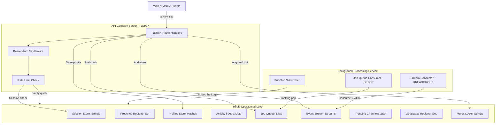
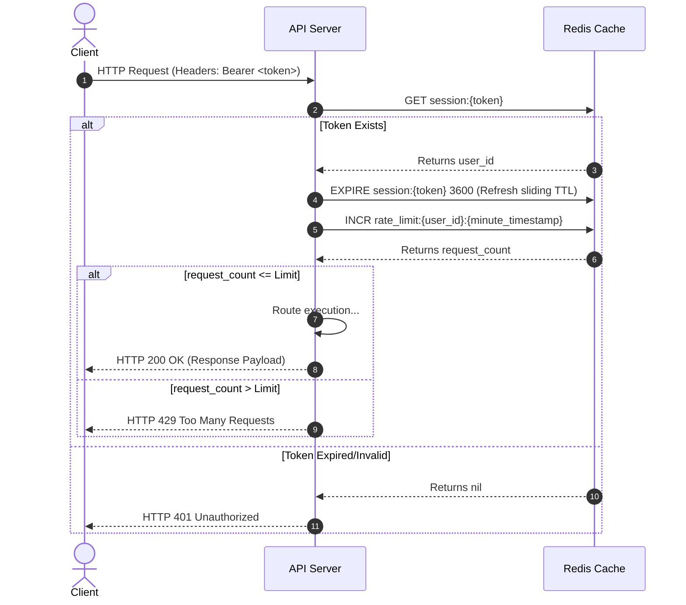
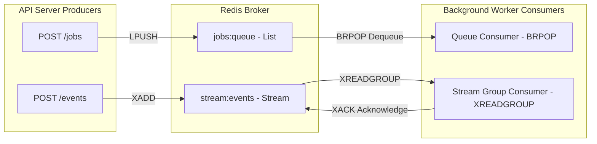
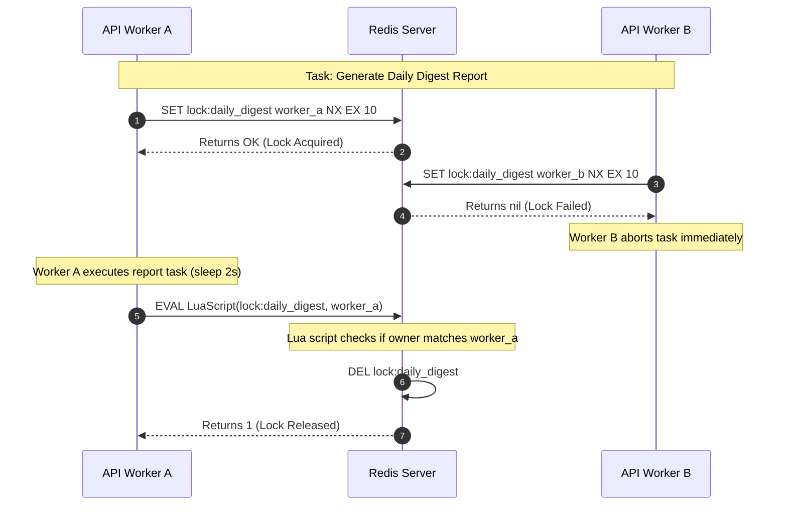

# ⚡ PulseBoard: Real-Time Collaborative Operations Platform

[](https://fastapi.tiangolo.com/)
[](https://redis.io/)
[](https://www.docker.com/)
[](https://www.python.org/)

PulseBoard is a high-performance, real-time backend engine engineered for remote SRE, Devops, and operations teams to coordinate incidents, system deployments, and live operations events. 

To solve common production bottlenecks—such as inconsistent API latency, notification lag, and database read/write strain—PulseBoard utilizes **Redis** as a core component for real-time state, session storage, rate limiting, pub/sub messaging, event streaming, distributed coordination, and telemetry analytics.

---

## 🗺️ System Architecture

PulseBoard uses a decoupled, event-driven architecture that separates REST request handling from asynchronous background workloads using Redis data structures:



---

## 🔄 Execution & Data Flows

### 1. Bearer Authentication & Sliding Rate Limiter Flow
All authenticated routes execute session validation and checking of minute quotas before dispatching queries:



### 2. Asynchronous Job & Event Stream Processing
Long-running jobs are enqueued onto a List queue, and telemetry updates are streamed using Redis Streams:



### 3. Distributed Mutual Exclusion Lock Path
Coordinating periodic routines (e.g. daily report compiling) safely using Redis distributed locking:



---

## 📂 Codebase Folder Structure

```text
pulseboard-backend/
├── app/
│   ├── __init__.py
│   ├── config.py          # Configuration loading using pydantic-settings
│   ├── main.py            # FastAPI REST routing definitions & middleware
│   ├── mock_data.py       # Initial operational database seeder
│   ├── redis_client.py    # Connection pools and Distributed Lock module
│   └── worker.py          # Background queues and stream event consumer
├── .env                   # Local configuration file (ignored by Git)
├── .env.example           # Example config configuration template
├── .gitignore             # Git ignored paths and rules
├── Dockerfile             # Multi-stage container definition
├── docker-compose.yml     # Services link configuration (Redis, API, Worker)
├── requirements.txt       # Python dependency declarations
└── verify_pulseboard.py   # E2E Automated Integration Test Suite
```

---

## 🚀 Setup & Installation Steps

### Option A: Running via Docker Compose (Recommended)

1. **Configure Environment**:
   ```bash
   cp .env.example .env
   ```
   *Note*: The `.env` template configures Redis to bind to port **`6389`** on the host. This prevents port allocation conflicts if there is already an active Redis server running on your system on port `6379`.

2. **Boot up Services**:
   ```bash
   docker compose up --build -d
   ```
   This automatically:
   - Builds the python runner container.
   - Spins up Redis (`pulseboard-redis`), API Server (`pulseboard-api`), and background worker (`pulseboard-worker`).
   - **Auto-seeds mock workspaces, members, profiles, channels, activity metrics, and active locations on boot**.

3. **Check Logs**:
   ```bash
   docker compose logs -f
   ```

---

### Option B: Running Locally

1. **Install Prerequisites**:
   Python 3.11+ is required. Set up a virtual environment and install packages:
   ```bash
   python -m venv .venv
   source .venv/bin/activate  # On Windows: .venv\Scripts\activate
   pip install -r requirements.txt
   ```

2. **Configure Port Settings**:
   Create a `.env` file and make sure `REDIS_PORT` matches your running local Redis instance:
   ```env
   REDIS_HOST=localhost
   REDIS_PORT=6379 # Or 6389
   ```

3. **Run seeder**:
   ```bash
   python -m app.mock_data
   ```

4. **Start Web Server**:
   ```bash
   uvicorn app.main:app --port 8000 --reload
   ```

5. **Start Worker Service**:
   ```bash
   python -m app.worker
   ```

---

## 🧪 Integration Testing & Verification

A comprehensive automated integration test suite (`verify_pulseboard.py`) is provided. It hits all FastAPI endpoints to assert they correspond to correct Redis commands.

To execute the tests inside the running API container:
```bash
docker compose exec api python verify_pulseboard.py
```

### Output Results
```text
==================================================
Starting PulseBoard Redis Backend Integration Tests
==================================================
Testing: 1. Sessions & Authentication
[✓] Login successful. User ID: usr_cd8aab92, Session Token: f1fe038f...

Testing: 2. User Profiles
[✓] User profiles created, updated, and retrieved successfully.

Testing: 3. Attendance Tracking & HLL Daily Active Users
[✓] Attendance tracked via Bitmaps and DAU counted via HLL. Active users today: 3

Testing: 4. Presence Tracking
[✓] Presence tracking (go online/offline, SMEMBERS, SISMEMBER) works.

Testing: 5. Workspaces & Membership Intersection
[✓] Workspace membership creation, retrieval, and SINTER intersection lookup works.

Testing: 6. Activity Feed
[✓] Activity feed retrieved (chronological, capped size LTRIM).

Testing: 7. Real-Time Messaging & Trending Channels
[✓] Messaging broadcast (Pub/Sub) and trending channels ranking (Sorted Sets) works.

Testing: 8. Event Streaming
[✓] Event streaming producer (XADD) works. Event ID: 1786600830450-0

Testing: 9. Distributed Locking
[✓] Distributed lock acquired, held safely, and released atomically using Lua.

Testing: 10. Geospatial Awareness
[✓] Geospatial awareness (GEOADD & GEOSEARCH radius check) works.

Testing: 11. Background Job Queue
[✓] Job enqueued onto List queue. Job ID: 45c15cde-26df-43ee-ad9d-9d35afd9370b

Testing: 12. API Rate Limiting
[✓] API Rate limiter correctly rejected spam requests with HTTP 429.

==================================================
ALL INTEGRATION TESTS PASSED SUCCESSFULLY! (12/12)
==================================================
```

---

## ⚙️ Redis Usage & Commands Reference

| Operational Feature | Target Endpoint | Redis Commands Utilized |
| :--- | :--- | :--- |
| **Sessions & Auth** | `POST /auth/login` | `SETEX`, `GET`, `EXPIRE`, `DEL` |
| **Rate Limiter** | All (Middleware) | `INCR`, `EXPIRE` |
| **Profiles Store** | `GET /users/:id/profile` | `HSET`, `HGETALL`, `HMGET`, `EXISTS` |
| **Presence Registry** | `POST /presence/online` | `SADD`, `SREM`, `SMEMBERS`, `SISMEMBER` |
| **Workspace intersection**| `GET /workspaces/common` | `SADD`, `SINTER` |
| **Activity Feed** | `GET /users/:id/feed` | `LPUSH`, `LTRIM`, `LRANGE` |
| **Pub/Sub Messaging** | `POST /channels/:id/messages`| `PUBLISH`, `SUBSCRIBE` |
| **Event Stream Logs** | `POST /events` | `XADD`, `XREADGROUP`, `XACK` |
| **Trending Channels** | `GET /analytics/trending` | `ZINCRBY`, `ZREVRANGE` |
| **Mutex Locks** | `POST /locks/trigger-daily-digest`| `SET NX EX`, Lua `EVAL` |
| **Daily Active Users**| `GET /analytics/dau` | `PFADD`, `PFCOUNT` |
| **Attendance Bitmaps**| `GET /attendance/:id/count`| `SETBIT`, `GETBIT`, `BITCOUNT` |
| **Geospatial Queries**| `GET /geo/nearby` | `GEOADD`, `GEOSEARCH` |
| **Job Queueing** | `POST /jobs` | `LPUSH`, `BRPOP` |
