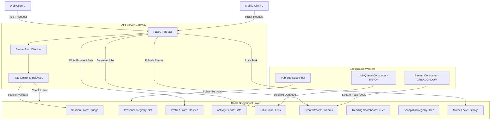
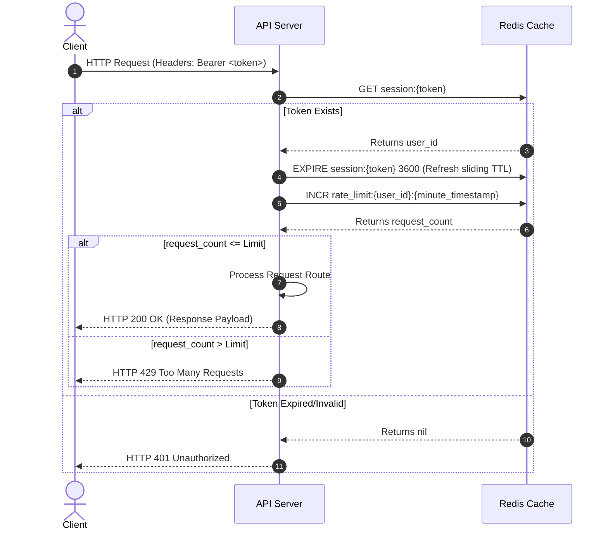
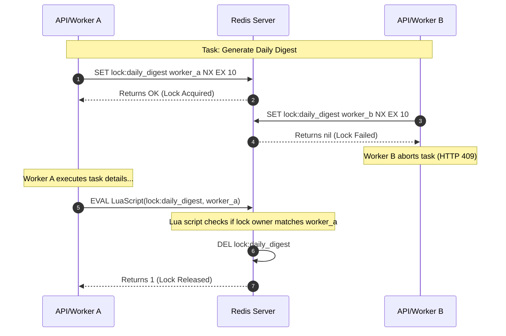

# PulseBoard System Architecture Deep Dive

This document details the system design, network routing, and component interactions of the **PulseBoard Real-Time Operations Platform**.

---

## 🗺️ System Topology

PulseBoard's architecture separates concerns across three main layers: the API server (ingestion and control), the message & storage broker (Redis), and the background processing services (workers).



---

## 🔄 Dynamic Flows

### 1. Request Authentication & Rate Limiting Flow
Every incoming REST request undergoes a two-step validation in the middleware layer using Redis:



### 2. Distributed Locking Sequence
The distributed locking mechanism coordinates background tasks (like compiling daily digests) to prevent double execution:



---

## 🏗️ Architectural Core Modules

### 1. FastAPI Web Server
- **Routing**: Clean, async REST endpoints mapped to specific operation modules.
- **Lifespan Context**: Orchestrates safe database startup connection ping tests and initiates mock seeder scripts.
- **Dependencies**: Injects user identity check and rate limit verification on a per-route basis.

### 2. Connection Manager (`app/redis_client.py`)
- **Async Connection Pool**: Manages non-blocking event loops inside FastAPI.
- **Sync Connection Pool**: Utilized by worker service running synchronous or background thread blocks.
- **Mutex Manager**: Exports `AsyncDistributedLock` and `SyncDistributedLock` modules which implement the `SET NX EX` pattern and release locks atomically using an custom Lua script:
  ```lua
  if redis.call("get", KEYS[1]) == ARGV[1] then
      return redis.call("del", KEYS[1])
  else
      return 0
  end
  ```

### 3. Background Worker Engine (`app/worker.py`)
Runs three separate, non-blocking asynchronous event loops:
- **FIFO Queue Listener**: Executes `BRPOP` against `jobs:queue` list with a timeout to fetch and complete asynchronous background tasks.
- **Stream Consuming Service**: Performs `XREADGROUP` queries against `stream:events` to process stream messages, sending back `XACK` on success. Automatically recreates consumer groups if a `NOGROUP` error is caught.
- **Pub/Sub Subscriber**: Listens to wildcard matching channel patterns `channel:*:messages` and `channel:*:typing`, broadcasting logs directly to the console.

---

## ⚡ Technical Stack & System Design Rationale

- **FastAPI**: Chosen over Flask/Django for its native support for python async/await event loops, which perfectly pairs with `redis.asyncio`. It also provides automatic OpenAPI/Swagger UI generation.
- **Redis as Primary State Store**: Leverages ultra-low latency RAM databases for ephemeral state (sessions, presence, locks, feeds, locations).
- **Docker Compose Orchestration**: Enables isolated, reproducible multi-container runtimes on any environment, resolving port conflicts programmatically via mapped configurations.

---

## 📈 Advantages & Disadvantages of the Architecture

### Advantages
1. **Low Request Latency**: ephemeral queries (session checks, rates) complete in sub-millisecond speeds due to Redis in-memory storage.
2. **Decoupled Workloads**: If the background worker fails or experiences heavy load, the HTTP API server continues to ingest incoming client requests without blockage.
3. **Optimized Memory Usage**: Using **HyperLogLogs** for DAU counts saves megabytes of storage, and **Bitmaps** track monthly attendance in less than 4 bytes per user.

### Disadvantages
1. **Lack of Relational Queries**: Storing user profiles and relationships in Redis Hashes/Sets prevents performing complex SQL joins.
2. **Persistence Dependency**: In-memory stores require configuring AOF (Append Only File) or RDB snapshots to prevent data loss in the event of a sudden server crash.
